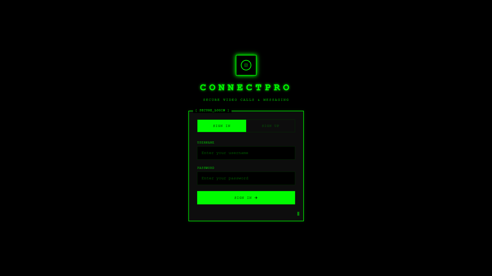
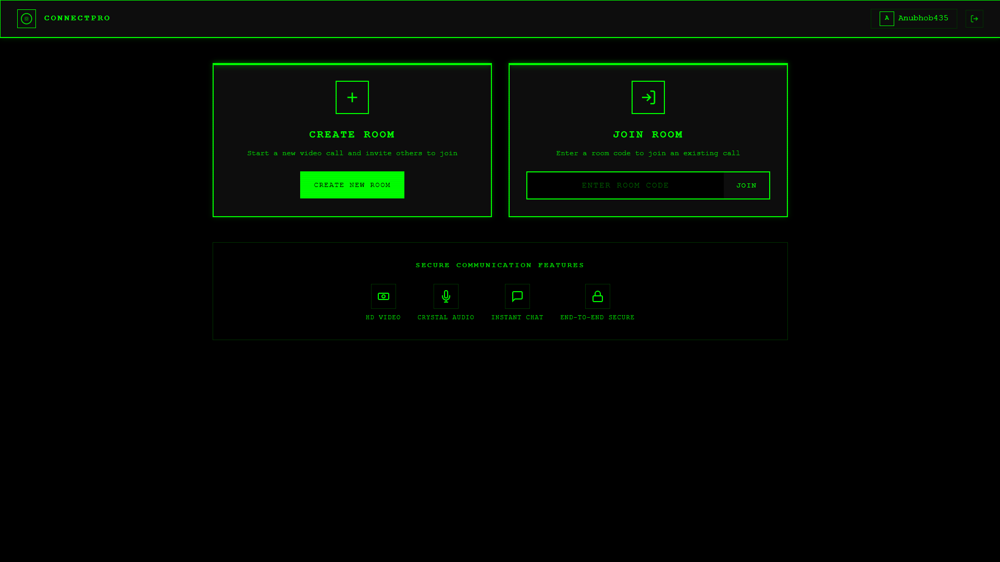

# ConnectPro - WebRTC Communication App

A secure peer-to-peer video calling, audio calling, and text messaging application built with Python and WebRTC.


## 📸 Screenshots

<p align="center">
  
  
</p>
<p align="center">
  <em>Login Page</em> &nbsp;&nbsp;&nbsp;&nbsp;&nbsp;&nbsp;&nbsp;&nbsp;&nbsp;&nbsp;&nbsp;&nbsp;&nbsp;&nbsp;&nbsp;&nbsp;&nbsp;&nbsp;&nbsp;&nbsp;&nbsp;&nbsp;&nbsp;&nbsp;&nbsp;&nbsp;&nbsp;&nbsp;&nbsp;&nbsp;&nbsp;&nbsp;&nbsp;&nbsp;&nbsp;&nbsp;&nbsp;&nbsp;&nbsp;&nbsp;&nbsp;&nbsp;&nbsp;&nbsp;&nbsp;&nbsp;&nbsp;&nbsp;&nbsp;&nbsp;&nbsp;&nbsp;&nbsp;&nbsp;&nbsp;&nbsp;&nbsp;&nbsp;&nbsp;&nbsp; <em>Lobby (After Login)</em>
</p>

## ✨ Features

- 🎥 **HD Video Calls** - Crystal clear peer-to-peer video with multi-participant support
- 🎤 **Crystal Audio** - High-quality audio with echo cancellation & noise suppression
- 💬 **Instant Chat** - Real-time text messaging during calls
- 🔒 **Secure** - HTTPS + JWT authentication + encrypted media
- 🖥️ **Dark Web UI** - Solid black, boxy terminal-style design
- 📱 **Responsive** - Works on desktop and mobile
- 👥 **Multi-Peer** - Support for 3+ participants in a room

## 🚀 Quick Start

### Prerequisites

- Python 3.11+
- pip or [uv](https://github.com/astral-sh/uv) package manager

### Local Development

1. **Navigate to the project:**
   ```bash
   cd Adams-call
   ```

2. **Create virtual environment and install dependencies:**
   ```bash
   # Using pip
   python -m venv .venv
   .venv\Scripts\activate  # Windows
   # source .venv/bin/activate  # Linux/Mac
   pip install -r requirements.txt

   # Or using uv
   uv venv
   .venv\Scripts\activate
   uv pip install -r requirements.txt
   ```

3. **Run the server:**
   ```bash
   python -m server.main
   ```

4. **Open in browser:**
   ```
   https://localhost:8443
   ```
   
   > ⚠️ Accept the self-signed certificate warning in your browser

## ☁️ Deploy to Render

This project is configured for easy deployment on [Render](https://render.com).

### One-Click Deploy

1. Push your code to GitHub
2. Go to [render.com](https://render.com) → New → Blueprint
3. Connect your repository
4. Render auto-detects `render.yaml` and deploys

### Manual Deploy

1. Create a new **Web Service** on Render
2. Connect your GitHub repository
3. Configure:
   - **Runtime:** Python 3
   - **Build Command:** `pip install -r requirements.txt`
   - **Start Command:** `python -m server.main`
4. Deploy!

See [RENDER_DEPLOY.md](RENDER_DEPLOY.md) for detailed instructions.

## 📖 Usage

1. **Create an Account** - Register with username (3+ chars) and password (6+ chars)
2. **Create or Join Room** - Start a new room or enter a 6-character room code
3. **Share Room Code** - Give the code to others to join
4. **Start Calling** - Video, audio, and chat are ready!

## 🎮 Call Controls

| Button | Action |
|--------|--------|
| 🎤 | Toggle microphone on/off |
| 📹 | Toggle camera on/off |
| 💬 | Open/close chat panel |
| 📋 | Copy room code to clipboard |
| 📞 | End call and return to lobby |

## 🏗️ Project Structure

```
Adams-call/
├── server/
│   ├── main.py          # HTTPS server entry point
│   ├── signaling.py     # WebSocket signaling server
│   ├── auth.py          # JWT authentication & user management
│   └── rooms.py         # Room & participant management
├── static/
│   ├── index.html       # Main UI
│   ├── css/styles.css   # Dark web theme styling
│   └── js/
│       ├── app.js       # Application logic & UI
│       ├── webrtc.js    # WebRTC client (multi-peer)
│       └── chat.js      # Chat functionality
├── certs/               # SSL certificates (auto-generated)
├── render.yaml          # Render deployment config
├── runtime.txt          # Python version specification
└── requirements.txt     # Python dependencies
```

## 🔧 Configuration

Environment variables:

| Variable | Default | Description |
|----------|---------|-------------|
| `HOST` | `0.0.0.0` | Server bind address |
| `PORT` | `8443` | Server port (Render sets this automatically) |
| `JWT_SECRET_KEY` | Auto-generated | JWT signing key |
| `RENDER` | - | Auto-set by Render (skips local SSL) |

## 🛡️ Security

- **HTTPS** - TLS encryption (auto SSL on Render, self-signed locally)
- **JWT Tokens** - Secure session authentication
- **Bcrypt** - Password hashing
- **WebRTC DTLS-SRTP** - End-to-end encrypted media streams
- **ICE/STUN** - NAT traversal with multiple Google STUN servers

## 🎨 UI Theme

The app features a **dark web / hacker terminal** aesthetic:
- Pure black backgrounds (`#000000`)
- Neon green accents (`#00ff00`)
- Boxy design (no rounded corners)
- Monospace fonts
- Scanline effects
- Glowing borders on hover

## 🔄 Multi-Peer Support

The WebRTC implementation supports 3+ participants with:
- Sequential connection establishment
- ICE candidate queuing
- Glare (offer collision) handling
- Automatic ICE restart on failure
- Connection state recovery


---

```
 ██████╗ ██████╗ ███╗   ██╗███╗   ██╗███████╗ ██████╗████████╗██████╗ ██████╗  ██████╗ 
██╔════╝██╔═══██╗████╗  ██║████╗  ██║██╔════╝██╔════╝╚══██╔══╝██╔══██╗██╔══██╗██╔═══██╗
██║     ██║   ██║██╔██╗ ██║██╔██╗ ██║█████╗  ██║        ██║   ██████╔╝██████╔╝██║   ██║
██║     ██║   ██║██║╚██╗██║██║╚██╗██║██╔══╝  ██║        ██║   ██╔═══╝ ██╔══██╗██║   ██║
╚██████╗╚██████╔╝██║ ╚████║██║ ╚████║███████╗╚██████╗   ██║   ██║     ██║  ██║╚██████╔╝
 ╚═════╝ ╚═════╝ ╚═╝  ╚═══╝╚═╝  ╚═══╝╚══════╝ ╚═════╝   ╚═╝   ╚═╝     ╚═╝  ╚═╝ ╚═════╝ 
```


